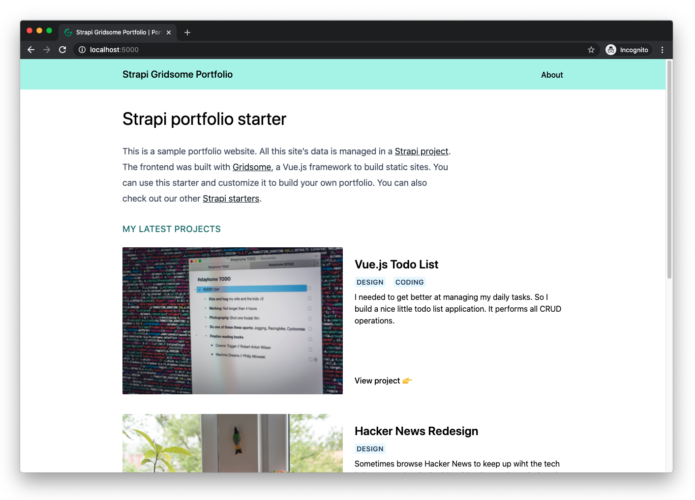

# Strapi Starter Gridsome Portfolio

Gridsome starter for creating a corporate site with Strapi.

[View the live demo](https://strapi-starter-gridsome-portfolio.vercel.app/) • [Watch the video tutorial](https://www.youtube.com/watch?v=4g3Pzj-wdXo&feature=youtu.be) • [Read the blog post](https://strapi.io/blog/strapi-starter-gridsome-portfolio)

[](https://strapi-starter-gridsome-portfolio.vercel.app/)

This starter allows you to easily create a website to showcase your work. It also makes it easy to keep it up to date thanks to Strapi.

It relies on several Strapi features:

* Collection types for projects and categories
* Single types for the homepage, the about page and the global config
* Components for reusable UI components and SEO metadata
* Dynamic zones to have full control over your content

On the frontend, we're using [Gridsome](https://gridsome.org/), a Vue.js framework for static sites. It uses GraphQL to query data and Tailwind CSS for styles.

## Getting started

The easiest way to try this starter is to run it locally on your computer.

First, you'll need to create your own copy of this starter. You can do so by clicking [the "Use this template" button](https://github.com/strapi/strapi-starter-gridsome-portfolio/generate) on GitHub, and filling the [form](https://docs.github.com/en/github/creating-cloning-and-archiving-repositories/creating-a-repository-from-a-template).

### Backend

Make sure you're in the `backend` directory:

```bash
cd backend
```

Install dependencies and run your server:

```bash
# Using yarn
yarn install
yarn develop

# Using npm
npm install
npm run develop
```

The first time you start your project, sample seed data will be imported.

### Frontend

Make sure you're in the `frontend` directory:

```bash
cd frontend
```

Install dependencies and start the Gridsome server:

```bash
# Using yarn
yarn install
yarn develop

# Using npm
npm install
npm run develop
```

The Gridsome server will run here => [http://localhost:8080](http://localhost:8080)

## Deploying to production

You will need to deploy the `frontend` and `backend` projects separately. Here are the docs to deploy each one:

* [Deploy Strapi](https://strapi.io/documentation/v3.x/admin-panel/deploy.html#deployment)
* [Deploy Gridsome](https://gridsome.org/docs/deployment/)

Don't forget to set up your environment variables on your production apps.

Have fun using this starter!
